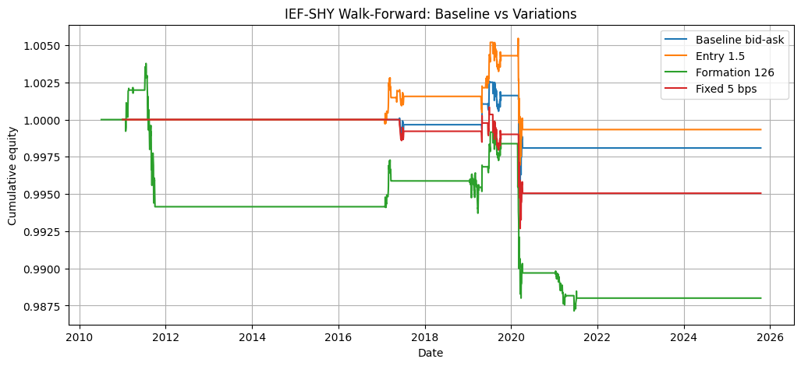
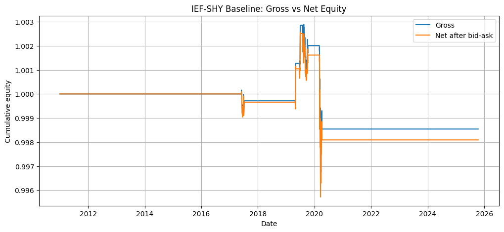
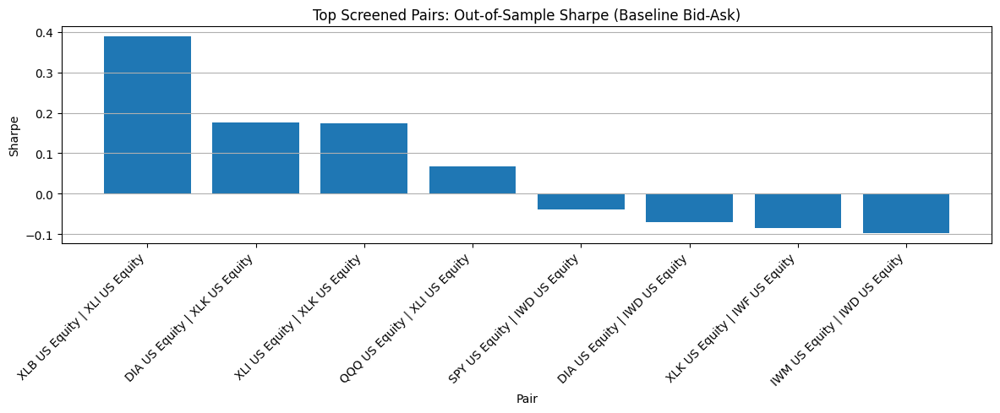
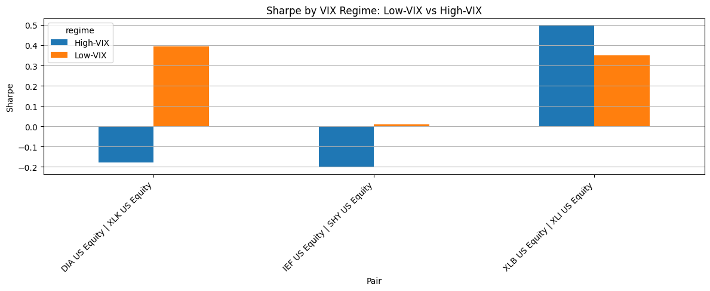
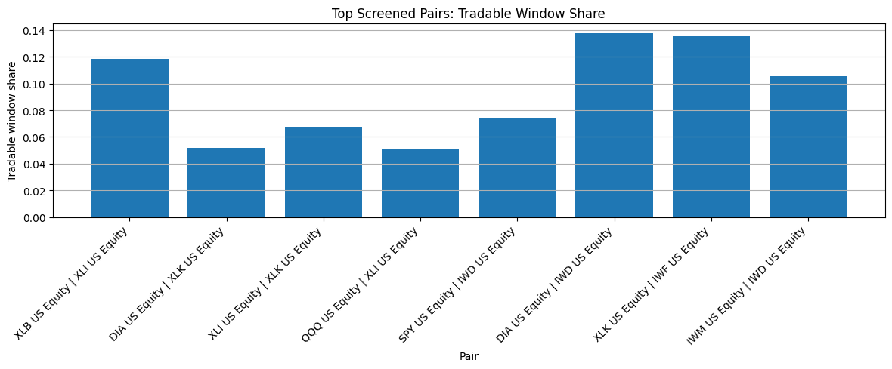

# Cointegration-Based ETF Pairs Trading

A Python research project on US ETF pairs trading using cointegration screening, rolling walk-forward backtesting, bid-ask transaction costs, and regime analysis.

## Current features

- Bloomberg-style ETF data parsing and reshaping
- Daily data cleaning and panel construction
- Mid-price and bid-ask half-spread estimation
- Correlation pre-filtering
- Engle–Granger cointegration screening
- OLS hedge ratio estimation
- Z-score spread construction and signal generation
- Rolling walk-forward backtesting
- Bid-ask-based transaction cost model
- Fixed-cost robustness comparison
- Pair-panel comparison across screened candidates
- Calendar and VIX regime analysis

## Key findings

- Universe: 25 US ETFs, daily data from 2010 to 2025
- Initial screening identified multiple attractive candidate pairs, but many weakened under strict rolling out-of-sample testing
- Only 4 of the top 10 screened pairs remained positive after costs
- Best baseline pair: XLB–XLI
  - Sharpe: 0.389
  - Annualised return: 0.74%
  - Max drawdown: -3.93%
- Case-study pair IEF–SHY was economically intuitive but unstable
  - passed only 5 of 59 rolling windows
  - Sharpe fell from 0.152 pre-2020 to -0.290 in 2020+
  - Sharpe was -0.203 in high-VIX conditions

## Example outputs

### IEF–SHY: Baseline vs Variations


### IEF–SHY: Gross vs Net Equity


### Top Screened Pairs: Out-of-Sample Sharpe


### Sharpe by VIX Regime


### Tradable Window Share


## Method overview

### Pair selection
Pairs are screened using:
- Correlation > 0.80
- Engle–Granger p-value < 0.05

### Spread construction
For each candidate pair:
- an OLS hedge ratio is estimated,
- the spread is constructed,
- and the spread is standardised into a z-score

### Trading rule
Baseline rule:
- Enter when `|z| > 2.0`
- Exit when `|z| < 0.5`

### Walk-forward setup
- 252 trading days formation window
- 63 trading days out-of-sample trading window
- repeated pair re-screening in each rolling window

### Transaction costs
- Primary model: bid-ask half-spread
- Robustness comparison: fixed 5 bps

### Regime analysis
Performance is compared across:
- Pre-2020 vs 2020+
- Low-VIX vs High-VIX

## Project structure

```text
pairs-trading/
├── assets/                 # README figures
├── data_raw/               # local raw Bloomberg-style exports
├── data_processed/         # cleaned datasets and exported result tables
├── notebooks/              # research workflow and analysis
├── README.md
└── .gitignore
```

## Main workflow

1. Load and reshape raw ETF data
2. Clean prices and construct spread-cost proxies
3. Screen candidate pairs
4. Run walk-forward backtests
5. Compare baseline and robustness variations
6. Run panel comparison across top screened pairs
7. Run regime analysis
8. Export summary tables and figures

## Notes

This project uses Bloomberg-derived ETF data, which cannot be redistributed publicly.

The repository is intended to show the research workflow, backtesting logic, and analysis pipeline rather than provide a fully reproducible public dataset.

## Current limitations

- No full market-impact model
- No portfolio construction across multiple eligible pairs
- No formal structural break model beyond regime comparison
- Limited to the selected ETF universe and daily frequency

